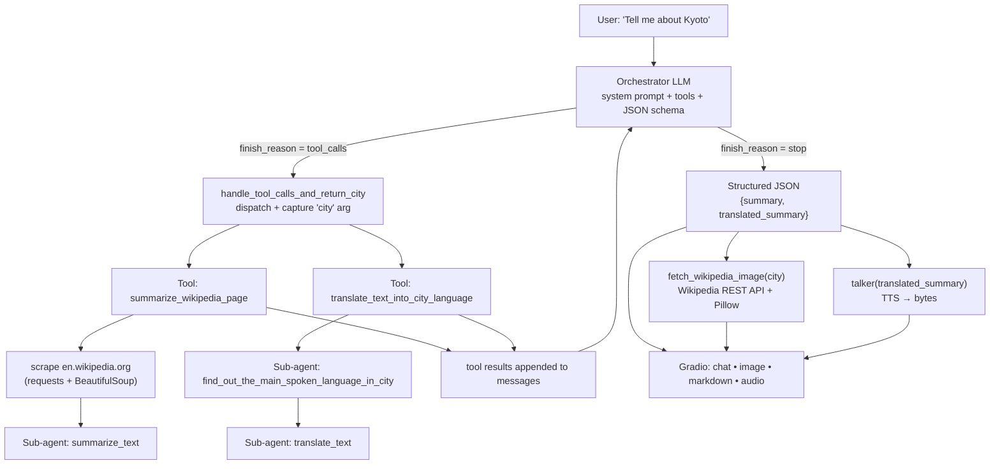

# City Traveler

**Type a city name, get an instant travel briefing — picture, summary, native-language version, and a spoken narration.**

City Traveler is an agentic chatbot that turns a bare city name into a rich, multi-modal destination card in a single turn:

| Output | What it is |
| --- | --- |
| 🖼️ **Image** | The lead photo of the city's Wikipedia page |
| 📝 **Summary** | A concise, structured, compelling digest of the English Wikipedia article (≤ 2000 chars) |
| 🌍 **Translated summary** | The same digest, rendered in the main language actually spoken in that city |
| 🔊 **Audio** | The translated summary read aloud, autoplayed |

The business value: what would normally be *"open Wikipedia → skim 8000 words → copy/paste into a translator → find a photo → record a voiceover"* becomes one sentence typed into a chat box. It's a template for any **"unstructured web page → structured, localized, multi-modal briefing"** pipeline — travel concierges, relocation assistants, sales-prospect one-pagers, onboarding briefs.

---

## Quickstart

### Prerequisites

- **Python 3.12+** (pinned to `3.12` in [.python-version](.python-version))
- **[uv](https://docs.astral.sh/uv/)** for dependency and environment management
- An **OpenAI API key** with access to chat completions + TTS

### 1. Install

```bash
git clone <repo-url>
cd city-traveler
uv sync
```

`uv sync` creates `.venv/` and installs everything from [uv.lock](uv.lock) — reproducible, no manual `pip install` needed.

### 2. Configure environment variables

Create a `.env` file at the repo root (it's gitignored):

```dotenv
OPENAI_API_KEY=sk-...
```

| Variable | Required | Used by |
| --- | --- | --- |
| `OPENAI_API_KEY` | ✅ Yes | Every LLM call and the TTS call, via the shared client in [constants.py:29](constants.py#L29) |

> `.env` is loaded by `load_dotenv()` in [app.py:23](app.py#L23) **before** `chat` is imported — that ordering matters, since [constants.py](constants.py) reads `OPENAI_API_KEY` at import time. Keep the import order as-is when refactoring.

### 3. Run

```bash
uv run app.py
```

Gradio starts and opens your browser automatically (`inbrowser=True`). Type *"Tell me about Kyoto"* and watch the four panes fill in.

### Useful commands

```bash
uv sync                      # install / re-sync dependencies from the lockfile
uv run app.py                # launch the Gradio app
uv run jupyter lab lab.ipynb # open the exploration notebook
uv add <package>             # add a dependency (updates pyproject.toml + uv.lock)
```

### Tuning models

All model choices live in one place, [constants.py](constants.py):

```python
MODEL = "gpt-4o-mini"          # orchestrator + every sub-agent
TTS_MODEL = "gpt-4o-mini-tts"  # voice synthesis
HAS_REASONING_EFFORT = False   # flip to True for reasoning-capable models
```

`HAS_REASONING_EFFORT` gates whether a `reasoning_effort` kwarg is sent with each completion ([chat.py:35](chat.py#L35)) — reasoning models accept it, `gpt-4o-mini` rejects it. Switch the model, switch the flag.

---

## How it works

One user message triggers a full agentic run:



### 1. The agentic loop

[chat.py:46-67](chat.py#L46-L67) is a classic tool-use loop:

```python
response = openai.chat.completions.create(model=MODEL, messages=messages, tools=tools, response_format=RESPONSE_FORMAT)
while response.choices[0].finish_reason == "tool_calls":
    ...append assistant message + tool results...
    response = openai.chat.completions.create(...)   # ask again with the new evidence
```

The orchestrator decides **which** tools to call and **in what order** — nothing is hardcoded. It loops until the model stops asking for tools and emits a final answer. The model may call tools in parallel within a turn; `handle_tool_calls_and_return_city` executes every call in the batch.

### 2. Tools

Tools are **generated from Python functions**, not hand-written JSON. [tools.py](tools.py) introspects a function's `__name__` and `__doc__` to build its OpenAI tool schema:

```python
def turn_function_into_tool(func, required_parameters):
    name, description = get_function_name_and_description(func)   # __name__ + __doc__
    ...
```

That means **the docstring is the prompt**. Rewrite `summarize_wikipedia_page.__doc__` and you've changed how the model decides to use it. Two tools are exposed today:

| Tool | Signature | Docstring-as-description |
| --- | --- | --- |
| `summarize_wikipedia_page` | `(city: str)` | *Fetches the Wikipedia page for a given city and summarizes its content.* |
| `translate_text_into_city_language` | `(text: str, city: str)` | *Translates the given text into the main language spoken in the specified city.* |

Dispatch is by name lookup against the module namespace ([chat.py:22](chat.py#L22)):

```python
tool = globals()[tool_name]
result = tool(**tool_args)
```

> ⚠️ **Gotcha when adding a tool:** `globals()` resolves against **`chat.py`'s** namespace. A new tool must be both registered in `define_tools()` *and* imported at the top of [chat.py](chat.py) — otherwise the loop raises `KeyError` at dispatch time.

The loop also **sniffs the `city` argument out of the tool call** ([chat.py:20-21](chat.py#L20-L21)). This is a neat trick: rather than asking the model to echo the city back, the orchestrator's own tool arguments become the source of truth for the downstream image fetch. No extra token spend, no hallucinated slug.

### 3. Sub-agents

Every tool is itself backed by one or more **specialized LLM calls with their own narrow system prompt** — small agents with one job each:

| Sub-agent | File | Job |
| --- | --- | --- |
| `summarize_text` | [helpers/summarizer.py](helpers/summarizer.py) | Compress a scraped page into ≤ 2000 chars of markdown, skipping navigation chrome |
| `find_out_the_main_spoken_language_in_city` | [helpers/translator.py](helpers/translator.py) | Answer with a language name and nothing else |
| `translate_text` | [helpers/translator.py](helpers/translator.py) | Translate into that language, markdown, no preamble |

The translator short-circuits: if the main language is English, the original text is returned untouched — no wasted call ([helpers/translator.py:46-47](helpers/translator.py#L46-L47)).

This keeps the orchestrator's context small. It never sees the raw 8000-word Wikipedia dump — only the compressed result. **Context isolation is the point of the sub-agent pattern here.**

### 4. Structured outputs

The final answer is constrained by a JSON schema passed as `response_format` ([constants.py:13-26](constants.py#L13-L26)):

```python
RESPONSE_FORMAT = {
    "type": "json_schema",
    "json_schema": {
        "name": "city_info",
        "schema": {
            "type": "object",
            "properties": {
                "summary":            {"type": "string"},
                "translated_summary": {"type": "string"},
            },
            "required": ["summary", "translated_summary"],
        },
    },
}
```

This is what makes the two-pane UI possible. The app doesn't parse prose — it does `json.loads(result)` and reads two guaranteed keys, routing each to its own widget: `summary` → chat transcript, `translated_summary` → markdown pane *and* the TTS input.

[prompt.py](prompt.py) reinforces the contract by embedding a **worked example of the JSON shape, with the field semantics written as the values** — including the no-city branch (answer conversationally, ask for a city, leave `translated_summary` empty). Schema + prompt example is belt-and-braces: the schema guarantees the *shape*, the prompt teaches the *meaning*.

### 5. Non-LLM enrichment

Two outputs are produced deterministically after the agent finishes — no model involved in choosing them:

- **Image** — [helpers/image_fetcher.py](helpers/image_fetcher.py) hits Wikipedia's REST summary endpoint (`/api/rest_v1/page/summary/<slug>`) for `originalimage.source`, then downloads it into a Pillow `Image` that Gradio renders directly.
- **Audio** — [helpers/talker.py](helpers/talker.py) sends the translated summary to the TTS model (voice `coral`), returning raw bytes to the Gradio audio player. Input is truncated to 4096 chars, the API limit.

---

## Features

- 💬 **Conversational** — full chat history is replayed into every request, so follow-ups work; asking without a city gets a normal answer plus a nudge to name one
- 🕸️ **Live scraping** — BeautifulSoup strips `script`/`style`/`img`/`input` from the Wikipedia body before the text ever reaches a model
- 🌐 **Automatic localization** — the target language is *inferred from the city*, not asked for
- 🔊 **Autoplaying narration** in the local language
- 🖼️ **Lead image** via the Wikipedia REST API
- 🧩 **Zero-boilerplate tool definitions** — add a documented Python function, get a tool
- 📐 **Schema-guaranteed output** — the UI binds to fields, never to prose
- 🎛️ **Single-file model config** — swap orchestrator and TTS models in [constants.py](constants.py)
- 📓 **Exploration notebook** — [lab.ipynb](lab.ipynb) holds the prototyping work the modules were extracted from

---

## Architecture

```
city-traveler/
├── app.py             # Entry point: loads .env, then launches the UI
├── chat.py            # 🧠 Orchestrator — agentic loop, tool dispatch, Gradio Blocks UI
├── constants.py       # Models, JSON response schema, shared OpenAI client
├── prompt.py          # System prompt builder (embeds the JSON contract by example)
├── tools.py           # Python function → OpenAI tool schema, via introspection
├── helpers/
│   ├── scraper.py         # requests + BeautifulSoup → clean page text
│   ├── summarizer.py      # Sub-agent: summarize a scraped Wikipedia page  [TOOL]
│   ├── translator.py      # Sub-agents: detect language + translate        [TOOL]
│   ├── image_fetcher.py   # Wikipedia REST API → Pillow Image
│   └── talker.py          # OpenAI TTS → audio bytes
├── lab.ipynb          # Prototyping notebook
└── .notes/learn/      # Learning notes written alongside the build
```

**Layering:** `app` → `chat` (orchestration + UI) → `tools` (schema generation) → `helpers` (sub-agents + I/O) → `constants` (config + client). Dependencies point one direction only; `helpers/` never imports `chat`.

**The UI** ([chat.py:87-132](chat.py#L87-L132)) is a two-column `gr.Blocks`: chat + input on the left, image + translated markdown + audio player on the right. A `.fill-pane` CSS class makes the panes share the 800px row height. The submit handler returns five values — including `""` for the textbox, which clears the input after each send.

### Tech stack

| | |
| --- | --- |
| **LLM** | OpenAI Chat Completions (tool calling + `json_schema` structured outputs) |
| **Speech** | OpenAI TTS |
| **UI** | Gradio Blocks |
| **Scraping** | requests + BeautifulSoup4 |
| **Images** | Wikipedia REST API + Pillow |
| **Config** | python-dotenv |
| **Packaging** | uv + `pyproject.toml` + `uv.lock` |

---

## Developer notes

**Adding a tool.** Three steps: (1) write a function in `helpers/` with a docstring that reads like an instruction to the model, (2) add its parameter schema and a `turn_function_into_tool(...)` call in [tools.py](tools.py), (3) **import it in [chat.py](chat.py)** so `globals()` can find it. Step 3 is the one that bites.

**Debugging a run.** The loop prints the incoming message and history ([chat.py:37-38](chat.py#L37-L38)), and each tool prints a `TOOL CALL: <name>` line when it fires. Watching the console tells you exactly which path the orchestrator chose.

**Pillow is transitive.** [helpers/image_fetcher.py](helpers/image_fetcher.py) imports `PIL`, but Pillow isn't listed in [pyproject.toml](pyproject.toml) — it arrives as a Gradio dependency. If Gradio ever drops it, the image pane breaks. Worth an explicit `uv add pillow`.

**The schema isn't strict.** `RESPONSE_FORMAT` omits `"strict": true` and `additionalProperties: false`, so the model is guided toward the shape rather than hard-constrained to it. Adding both would let you drop the belt-and-braces JSON example from [prompt.py](prompt.py).

**Failure modes to know.**
- A Wikipedia page that 404s makes `summarize_wikipedia_page` return `None`; the orchestrator sees an empty tool result and answers from that. Ambiguous city names (`Springfield`) hit Wikipedia disambiguation pages and summarize the disambiguation list rather than a city.
- Slug normalization ([helpers/scraper.py:25](helpers/scraper.py#L25)) lowercases and swaps spaces/hyphens for underscores — Wikipedia's redirects absorb most of this, but exotic names can miss.
- `history` is rebuilt from the Gradio chatbot each turn and only carries the English `summary`, not the translation — so follow-ups reason over the English text.

**Cost shape.** One user turn costs roughly: 2+ orchestrator calls (loop iterations) + 1 summarization + 1 language detection + 1 translation + 1 TTS call. Batching the language detection into the translation prompt would cut one round-trip.
